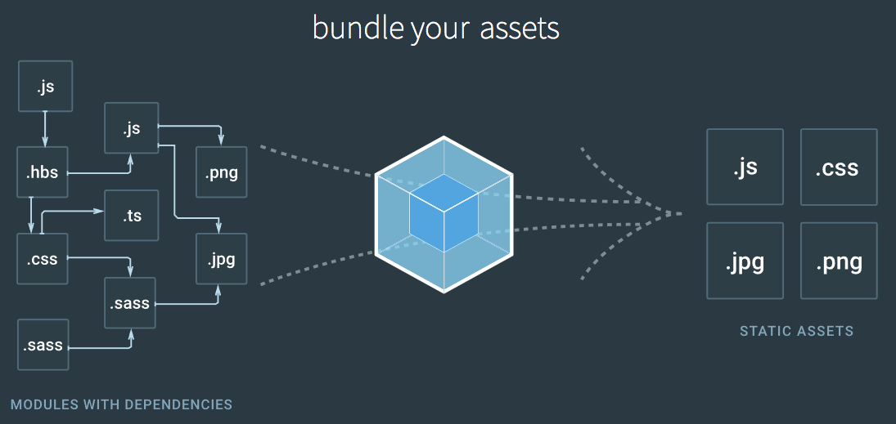

## webpack概述

> 文档部分翻译内容来自：https://github.com/webpack-china/webpack.js.org

`Webpack` 是当下最热门的前端资源模块化管理和打包工具。它可以将许多松散的模块按照依赖和规则打包成符合生产环境部署的前端资源。还可以将按需加载的模块进行代码分隔，等到实际需要的时候再异步加载。通过 `loader` 的转换，任何形式的资源都可以视作模块，比如 `CommonJs 模块`、 `AMD 模块`、 `ES6 模块`、`CSS`、图片、 `JSON`、`Coffeescript`、 `LESS` 等。

`webpack`已经是大部分前端项目打包工具的首选，`grunt`、`glup`、`browserify`等逐渐沦为辅助甚至完全被替代。在`grunt`、`glup`、`browserify`等已经相当火了之后，`webpack`长江后浪推前浪，把前辈们拍死在沙滩上，实力惊人。

根据`GitHub`上的迭代发展看来，通过`Issues`、`Release`、`Commit`等看，`webpack`发展相当不错，已经有`2.2`版本，最大的更新应该是支持`ES6 Modules`，根据`ES6`的特性来做一些`Code Splitting`等。

老式的任务运行器的方式：你的标记、样式和 `JavaScript` 是分离的。你必须分别管理它们每一个，并且你需要确保每一样都达到产品级

任务运行器`(task runner)`，例如 `Gulp`，可以处理许多不同的预处理器`(preprocesser)`和转换器`(transpiler)`，但是在所有的情景下，它都需要一个输入源并将其压缩到一个编译好的输出文件中。然而，它是在每个部分的基础上这样做的，而没有考虑到整个系统。这就造成了开发者的负担：找到任务运行器所不能处理的地方，并找到适当的方式将所有这些模块在生产环境中联合在一起。

`Webpack` 试图通过提出一个大胆的想法来减轻开发者的负担：如果有一部分开发过程可以自动处理依赖关系会怎样？如果我们可以简单地写代码，让构建过程最终只根据需求管理自己会怎样？

`Webpack` 的方式：如果 `Webpack` 了解依赖关系，它会仅捆绑我们在生产环境中实际需要的部分

如果你过去几年一直参与 `web` 社区，你已经知道解决问题的首选方法：使用 `JavaScript` 来构建。而且 `Webpack` 尝试通过 `JavaScript` 传递依赖关系使得构建过程更加容易。不过这个设计真正的亮点不是简化代码管理部分，而是管理层由 `100%` 有效的 `JavaScript` 实现 `（具有 Nodejs 特性）`。`Webpack` 能够让你编写有效的 `JavaScript`，更好更全面地了解系统。

换句话来说：你不需要为 `Webpack` 写代码。你只需要写项目代码。而且 `Webpack` 就会持续工作（当然需要一些配置）。

简而言之，如果你曾经遇到过以下任何一种情况：

- 1、载入有问题的依赖项
- 2、意外引入一些你不需要在生产中用上的 `CSS` 样式表和 `JS` 库，使项目膨胀
- 3、意外的两次载入（或三次）库
- 4、遇到作用域的问题 —— `CSS` 和 `JavaScript` 都会有
- 5、寻找一个让你在 `JavaScript` 中使用 `Node/Bower` 模块的构建系统，要么就得依靠一个令人发狂的后端配置才能正确地使用这些模块
- 6、需要优化资产 `asset` 交付，但你担心会弄坏一些东西
等等……

那么你可以从 `Webpack` 中收益了。它通过让 `JavaScript` 轻松处理你的依赖关系和加载顺序，而不是通过开发者的大脑。最好的部分是，`Webpack` 甚至可以纯粹在服务器端运行，这意味着你还可以使用 `Webpack` 构建渐进增强式网站。

[第一部分：概念](./knowledgePoint/readme.md)

- [入口起点（Entry Points）](./knowledgePoint/EntryPoints.md)

- [输出（Output）](./knowledgePoint/Output.md)